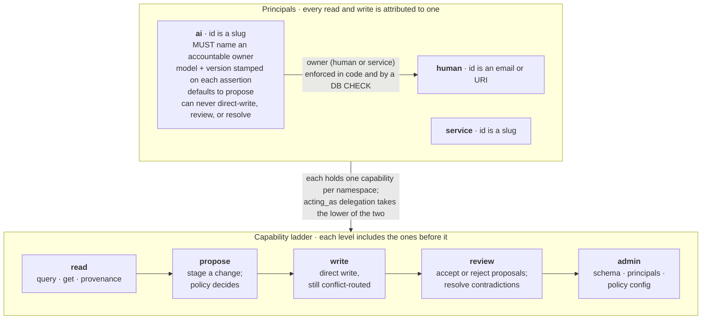
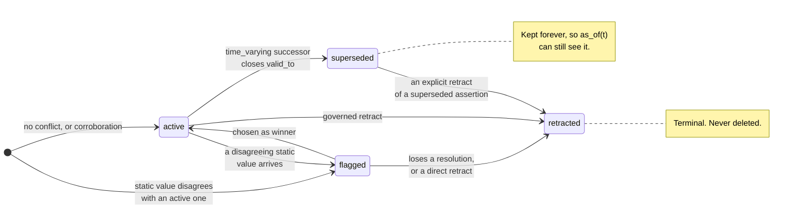
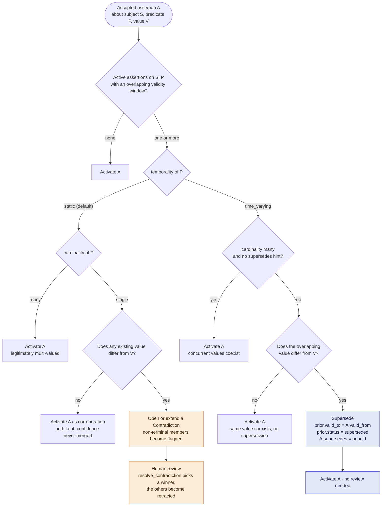
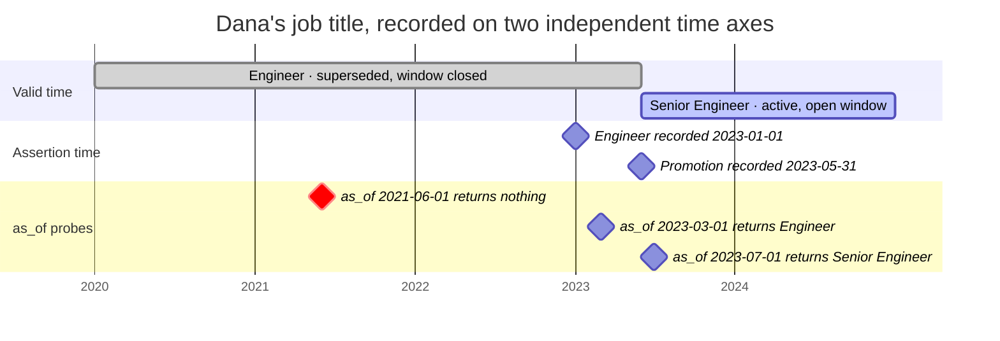

# Concepts

A handful of ideas everything else in Ontolith is built from. For the full
formal treatment, see the
[Technical Specification](https://github.com/ontolith/ontolith/blob/main/docs/Ontolith_SPEC.md) —
this page is the short version.

## Principals

A **principal** is an identified actor: `human`, `ai`, or `service` (the
latter for registered plugins). Every principal has a
**capability** — the ceiling on what it's allowed to do, ordered
`read < propose < write < review < admin` — and a **trust level**.

AI principals are structurally different, not just policy-different: they
**must** declare an accountable human/team **owner** — enforced both in
code and by a real database `CHECK` constraint (`CHECK (kind <> 'ai' OR
owner IS NOT NULL)`), not just convention — and every AI-authored
assertion captures the model family+version that made it (enforced in
code; no equivalent DB-level constraint exists for this second
requirement).



## Assertions are append-only

An assertion is a single `(subject, predicate, value)` fact with full
provenance attached (author, source, confidence, timestamps). Once written,
an assertion's `value` is **never edited in place** — only its `status` and
temporal-validity fields (`valid_to`, `supersedes`) may change. "Updating" a
fact always means: create a new assertion, and — depending on the
predicate's declared temporality — either close the old one's validity
window (supersession) or flag a dispute (contradiction). See
[Conflict Handling](#conflict-handling) below.

This is what makes full audit history and bitemporal time-travel possible:
nothing is ever destroyed, so `as_of(t)` can always reconstruct what was
known.



## Confidence and provenance

**Confidence** is a single scalar (0.0–1.0) representing the asserting
principal's own stated belief. It is *never* auto-combined across
corroborating sources in v1 — if three sources each assert the same fact at
confidence 0.9, you get three separate, queryable assertions, not one
merged 0.97. Corroboration is surfaced, not synthesized.

**Provenance** — who, what source, when, which model+version, why, and the
full delegation chain — is captured automatically on every assertion and
retrievable in a single call (`kb.provenance(assertion_id)`). The "why" is
a dedicated `rationale` field — free text, optional, accepted by
`assert_literal()`/`propose()`/`propose_ref()` right alongside `source` and
`confidence`. It's deliberately separate from the scalar: `confidence` is
the cheap signal a policy can threshold on without reasoning about it,
`rationale` is where the actual justification or cited evidence lives for
a human (or another agent) auditing the claim later. Neither replaces the
other, and neither drives the routing decision itself — whether a
differing value opens a contradiction or supersedes the prior one depends
only on the predicate's declared temporality and cardinality (§10.1); a
human resolving a contradiction has both `confidence` and `rationale`
available as context, but nothing is auto-ranked or auto-resolved from
them.

## Temporality: static vs. time-varying

Every property/relation declares a **temporality**: `static` (the default)
or `time_varying`. This one setting decides how Ontolith reacts when a
differing value arrives for the same subject+predicate:

- **`static`** — the property doesn't change over time (a person's date of
  birth). A differing value is a genuine disagreement — the check is on
  the value alone, not on who asserted it — so it's flagged as a
  **contradiction**, not silently overwritten.
- **`time_varying`** — the property changes over time as a matter of course
  (a person's job title). A differing value **supersedes** the prior one,
  closing its validity window — no dispute, no review needed, because change
  over time is expected.

Multiple `time_varying` values can coexist if their validity windows don't
overlap (an employment history). See the
[Bitemporal Queries tutorial](tutorials/bitemporal-queries.md) for this in
action.

## Conflict handling

Routing is determined by the predicate's declared temporality first, then
its cardinality — a caller never chooses "supersede vs. contradict"
directly, and the check is purely on the *value*, not on who authored it
(the same principal contradicting themselves routes exactly like two
different principals disagreeing):

```
existing := active assertions on (subject, predicate) whose validity overlaps
t := schema.temporality(predicate)          # "static" (default) | "time_varying"
c := schema.cardinality(predicate)          # "single" (default) | "many"

if t == "static":
    if c == "many":
        activate(new_assertion)   # legitimately multi-valued (e.g. phone numbers); no dispute possible
    elif any existing.value != new_assertion.value:
        contradict(existing + [new_assertion])   # disputed, routed to review
elif t == "time_varying":
    if c == "many" and no explicit supersedes-hint was given:
        activate(new_assertion)   # a new concurrent value, not a replacement (e.g. concurrent job titles)
    else:
        supersede(existing, new_assertion)   # expected change, no review
```



`cardinality="many"` (ADR-0017, extended to `time_varying` by ADR-0050)
changes what a differing, window-overlapping value means: for `static`, it
opts out of contradiction entirely (legitimately multi-valued, e.g. phone
numbers); for `time_varying`, it defaults to coexistence too (concurrent
values, e.g. two simultaneous job titles) unless the caller explicitly
names which specific existing assertion the new one replaces.

Flagged (contradicting) assertions are retained and queryable, but excluded
from default query results — you have to ask for them explicitly
(`status="flagged"`, or `.include_flagged()` on a `QueryBuilder`). A
`review`-or-above, non-AI principal resolves a contradiction explicitly with
`resolve_contradiction()`; nothing is ever auto-resolved.

## Bitemporality

Every assertion carries **two** independent time dimensions:

- **Valid time** (`valid_from`/`valid_to`) — when the fact was/is true in
  the real world.
- **Assertion time** (`asserted_at`) — when the knowledge base learned it.

`kb.as_of(t)` answers "what did we know at `t` about what was true at `t`" —
both dimensions must be satisfied. This is why a real historical fact can
still be invisible under `as_of()` at an early `t`, if the KB genuinely
hadn't recorded it yet: see the
[Bitemporal Queries tutorial](tutorials/bitemporal-queries.md) for a worked
example.



This is the scenario in
[`examples/bitemporal_queries.py`](https://github.com/ontolith/ontolith/blob/main/examples/bitemporal_queries.py),
run verbatim — the `as_of(2021-06-01)` probe really does return nothing even
though Dana was genuinely an engineer then, because the KB hadn't recorded
it yet.

## Governance: proposals and policy

A **capability**-limited principal (typically an AI) doesn't write directly —
it **proposes**. A pluggable `PolicyStrategy` (the default,
`ThresholdPolicy`, ships with the SDK) evaluates every proposal and returns
one of three decisions: auto-accept, require human review, or reject. AI
proposals always route to review under the default policy, regardless of
trust level — see the
[Governance & Review tutorial](tutorials/governance-and-review.md).

## Plugins run governed and sandboxed

Importers, exporters, reasoners, connectors, and validators are discovered
via Python entry points and registered with a capped storage capability —
the *lower* of what the plugin's own manifest requests (`read` by default;
a plugin that writes must explicitly declare at least `propose`) and what
the registrar grants at registration time (`propose` by default). Neither
side alone decides the outcome; least privilege applies to both.
Since ADR-0051, a plugin's one protocol entrypoint runs in a **sandboxed
child process** by default, with `capabilities.network`/`.filesystem`
enforced at the OS syscall level on Linux (seccomp). A reasoner's derived
assertions must enter through the same proposal path as everything else —
no plugin bypasses governance. See the
[Writing a Plugin tutorial](tutorials/writing-a-plugin.md).

## The MCP surface has no write tool

The Model Context Protocol server Ontolith ships exposes ten tools
(`schema`, `get`, `create_entity`, `query`, `provenance`,
`list_contradictions`, `propose`, `retract`, `flag_contradiction`,
`resubmit`) — but **none of them is a direct-write tool**. Every
write-shaped one (`create_entity`, `propose`, `retract`, `resubmit`) goes
through the same governed proposal/policy path any other write does; there
is no MCP tool that commits a value assertion unconditionally. An AI agent
talking to a knowledge base through MCP can never bypass governance, full
stop.
